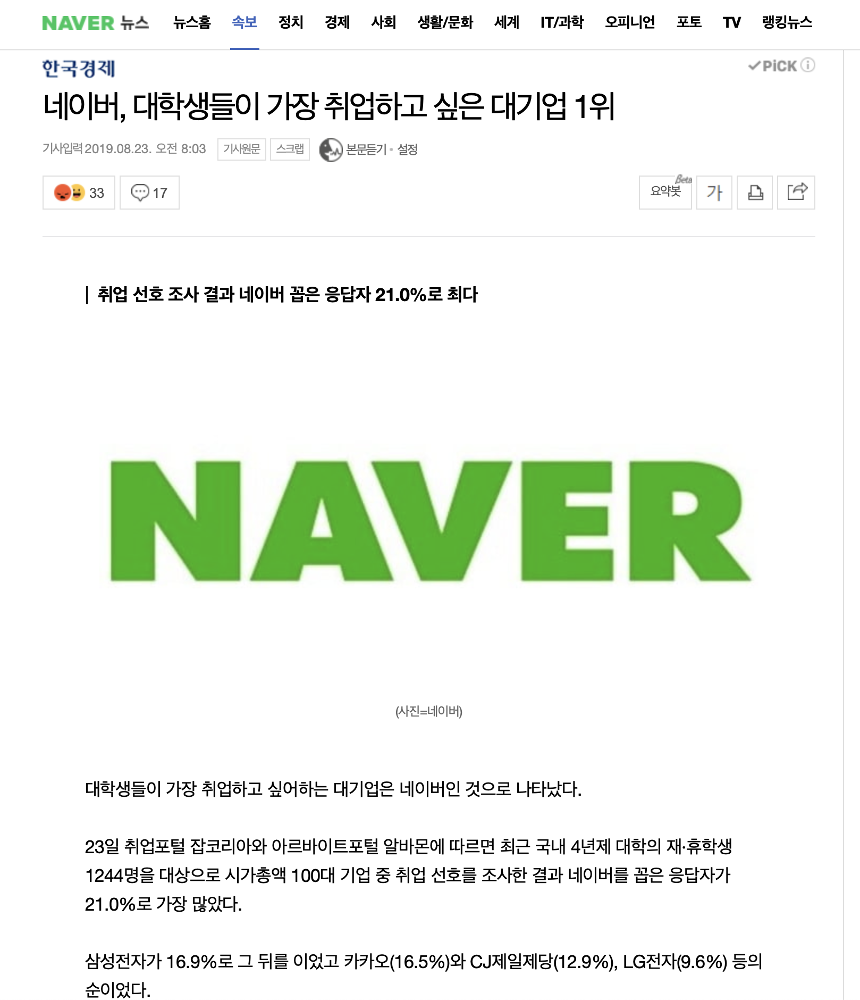
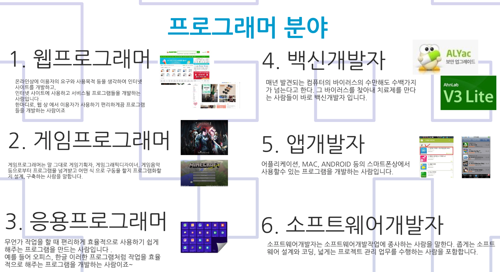
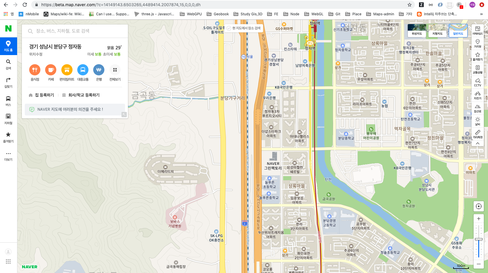

### NAVER

---
#### 대학생이 가장 취업하고 싶은 기업 ?
 

- 네이버 서비스
 
https://www.navercorp.com/service/featured

- 네이버 지도팀에서 개발하는 서비스 
 https://beta.map.naver.com/
 https://m.map.naver.com/
 https://m.place.naver.com/my/

### 프로그래머 ? 개발자 ? 코더 ? 

1. 프로그래머 분야
 
- 출처: https://prezi.com/qmpzxvfnxpv4/presentation/

2. 프로그래밍을 공부해야하는 이유
 https://www.youtube.com/watch?v=SESuctdE9vM&feature=youtu.be
 https://www.youtube.com/watch?v=KhptxxfMQ_Q&feature=youtu.be

3. 향후 전망
 https://www.youtube.com/watch?v=jiqOZdcJXN4&feature=youtu.be

### 나의 학창시절과 프로그래밍이란 ?

- 고교 내신 6~7등급(어떤 과목은 학교 운동부보다 등수가 낮게 나옴....)

- 고2때 서울생활하고 싶어 1년동안 빡공(수능 120점정도 올림)
- 동국대 멀티미디어공학과 입학 (feat. 성적 맞춰서)
- 논스톱같은 대학생활을 꿈꾸면서 흥청망청 놀았음, 결과는 학사경고
- 그러고 홀연히 입대...
 ...

인생의 역전드라마가 시작
 
 
 

 
 

- 군대다녀와서 제대로 전공공부를 하기 시작함
- 숨겨진 코딩의 재능을 찾음
- 하다보니 석사까지 공부했음
- 졸업 후 xx 회사에 입사(feat. 사랑해요 롯데)

 
 

- 우리나라 시총 5위 기업 및 50대까지 다닐 수 있는 안정적인 고용이였지만 치열하게 코딩하고 싶었음
- 두달간 열심히 준비하여 네이버로 이직
- 현재 네이버지도팀에서 만족하면서 열심히 개발하고 있음

#### 역시 개발자가 천직인가봄 - To be continued

